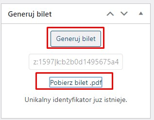

# wordpress-generate-uniqe-id
Generare uniqe id - in all system


### Install plugin - generate-uniqe-id

### To file adds - at the end
/wp-content/themes/twentyeleven-child/functions.php

##### Attach additional pdf for mail when mail is customer_completed_order
```
/*
Attach additional pdf for mail when mail is customer_completed_order
*/
add_filter('woocommerce_email_attachments', 'attach_ticket_customer_completed_order', 10, 3);
function attach_ticket_customer_completed_order($attachments, $id, $object)
{
  $order_id = method_exists($object, 'get_id') ? $object->get_id() : $object->id;
  $order = wc_get_order($order_id);


  if (is_file(GENERATE_UNIQE_ID_INCLUDES . 'generate_pdf.php')) {
    require_once GENERATE_UNIQE_ID_INCLUDES . 'generate_pdf.php';
  }


  if ($id === 'customer_completed_order') {
    $pdf_result = generateUniqeId_generateQrCodeAndTicketPdf($order);


    $attachments[] = $pdf_result['filePath'];


    return $attachments;
  }
}
```

##### Mark order as Complete when contains item with id 1572
```
/**
Mark order as Complete when contains item with id 1572
 */
add_action('woocommerce_thankyou', 'custom_woocommerce_auto_complete_order');
function custom_woocommerce_auto_complete_order($order_id)
{
  if (!$order_id) {
    return;
  }
  $order = wc_get_order($order_id);
  $are_virtual = generateUniqeId_order_contains_ticket_1572($order);


  if ($are_virtual) {
    $order->update_status('completed');
  }
}
```

### Generate ticket by hand in order details
.

### Additional files
There are additional files in `__additional` folder 
 
* login.php
* authorization.php
* weryfikacja.php
* weryfikacja_lib.php
* report.php

They are need to be add in wordpress root directory when we wanna use mobile app to confirm release.	
